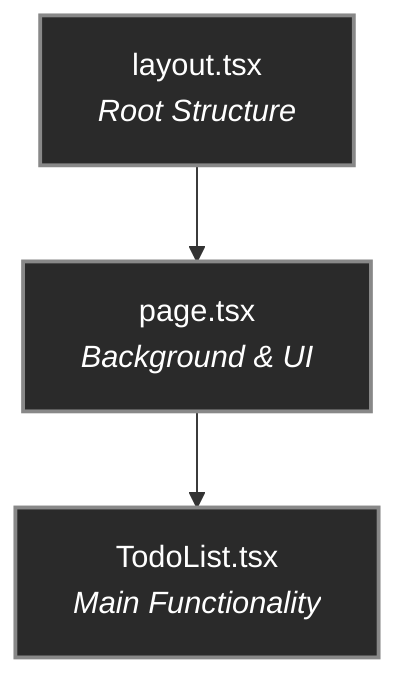
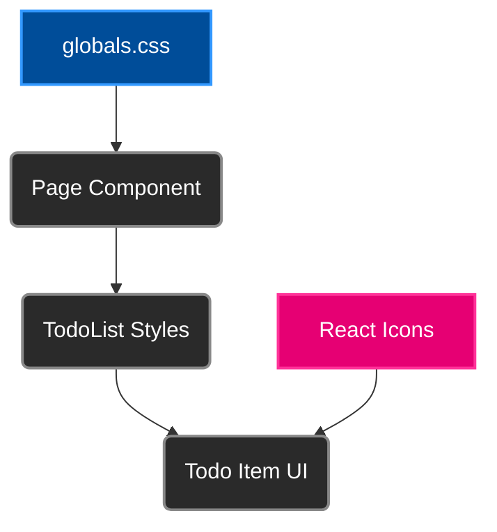

# DeepWiki: Next.js Colorful To-Do Application

## 1. 概要 (Overview)

This Next.js application implements a modern, colorful To-Do list with advanced UI features. It showcases core React and Next.js concepts including component architecture, state management, and styling techniques.

**Key Features:**
- Interactive To-Do list with add, complete, and delete functionality
- Vibrant UI with gradients, animations, and glassmorphism effects
- Responsive design for all device types
- Clean component separation and state management
- Deployed to Netlify with continuous integration

## 2. リポジトリ構造 (Repository Structure)

```
my-next-app/
├── .next/                  # Build output
├── public/                 # Static assets
├── src/
│   ├── app/                # Next.js App Router
│   │   ├── globals.css     # Global styles
│   │   ├── layout.tsx      # Root layout
│   │   ├── not-found.tsx   # 404 page
│   │   └── page.tsx        # Home page
│   ├── components/         # React components
│   │   └── TodoList.tsx    # Main To-Do list component
├── tailwind.config.ts      # Tailwind configuration
├── next.config.ts          # Next.js configuration
├── netlify.toml            # Netlify deployment config
├── package.json            # Dependencies and scripts
└── README.md               # Project documentation
```

## 3. 主要コンポーネント (Core Components)

### TodoList Component
- **Purpose**: Main application component managing To-Do items
- **Location**: `src/components/TodoList.tsx`
- **State**: 
  - `todos`: Array of to-do items with properties for id, text, completion status, and creation date
  - `inputText`: Current value of the input field
- **Functions**:
  - `handleAddTodo`: Adds new tasks
  - `handleToggleTodo`: Marks tasks as complete/incomplete
  - `handleRemoveTodo`: Deletes tasks
  - `formatDate`: Formats task creation dates

### Page Component
- **Purpose**: Entry point and layout container
- **Location**: `src/app/page.tsx`
- **Features**:
  - Sets up animated background
  - Contains gradient orbs for visual effect
  - Renders the TodoList component

### Layout Component
- **Purpose**: Root layout for the entire application
- **Location**: `src/app/layout.tsx`
- **Features**:
  - Sets up HTML document structure
  - Includes metadata and viewport settings

## 4. Architecture Diagrams

### Purpose & Perspective
This architecture diagram is designed for developers to understand the component relationships and data flow within the application.

### Component Flow Diagram



### State Management Flow

```mermaid
flowchart LR
    subgraph TodoList.tsx
        direction LR
        subgraph User_Actions
            A[Input Text]
            B[Add Task]
            C[Toggle Task]
            D[Delete Task]
        end

        subgraph State
            S1[inputText]
            S2[todos[]]
        end

        A -- Updates --> S1;
        B -- Updates --> S2;
        C -- Updates --> S2;
        D -- Updates --> S2;
    end

    style User_Actions fill:#1a1a1a,stroke:#555
    style State fill:#1a1a1a,stroke:#555
```

### Styling Architecture



## 5. API Documentation

### Context & Design Philosophy

This application implements a client-side Todo management system. While it doesn't utilize external APIs, it follows clear patterns for data management that could be extended to use REST or GraphQL APIs in the future.

### Component API: TodoList

#### State Interface
```typescript
interface Todo {
  id: number;
  text: string;
  completed: boolean;
  createdAt: Date;
}
```

#### Function Signatures

```typescript
const handleAddTodo = () => void
// Creates a new Todo item when input is not empty

const handleToggleTodo = (id: number) => void
// Toggles the completed status of a Todo item

const handleRemoveTodo = (id: number) => void
// Removes a Todo item from the list

const formatDate = (date: Date) => string
// Returns a formatted date string
```

### Typical Use Cases & Flows

1. **Adding a new task**:
   - User types task text in input field
   - User clicks add button or presses Enter
   - Task appears at top of list with current timestamp

2. **Completing a task**:
   - User clicks on task checkbox or text
   - Task is visually marked as complete
   - Task count updates in footer

3. **Deleting a task**:
   - User hovers over task to reveal delete button
   - User clicks delete button
   - Task is removed from list

### Error Handling & Edge Cases

- **Empty input**: Prevented by disabling the add button when input is empty
- **Long task text**: UI handles text wrapping for long content
- **No tasks state**: Shows a friendly empty state message

## 6. Testing

### Testing Strategy & Objectives

The application can be tested using multiple approaches:

#### Unit Tests
- Test individual functions like `handleAddTodo`, `handleToggleTodo`, etc.
- Verify state changes work as expected

#### Integration Tests
- Test component interactions
- Verify UI updates when state changes

#### E2E Tests
- Test the complete user flow from adding to completing tasks

### Test ViewPoints

| Viewpoint | Description | Focus Areas |
|-----------|-------------|-------------|
| Functional | Does each feature work correctly? | Task addition, completion, deletion |
| UI/UX | Is the interface user-friendly? | Layout, colors, animations, responsiveness |
| Performance | Does the app respond quickly? | Render time, animation smoothness |
| Accessibility | Can all users access features? | Keyboard navigation, screen readers |

### Test Cases

#### Test Case 1: Add Task
1. Open application
2. Type "Buy groceries" in input field
3. Click add button
4. **Expected**: New task appears with text "Buy groceries"

#### Test Case 2: Complete Task
1. Add a new task
2. Click on the task's checkbox
3. **Expected**: Task appears with strikethrough text and checkbox becomes checked

#### Test Case 3: Delete Task
1. Add a new task
2. Hover over the task
3. Click the delete button
4. **Expected**: Task is removed from the list

#### Test Case 4: Empty Input Validation
1. Open application
2. Click add button without typing text
3. **Expected**: No new task is added

## 7. デプロイメント／ビルド (Deployment / Build)

### Build Process
1. Next.js compilation and optimization:
   ```bash
   npm run build
   ```

2. Output structure:
   - Static HTML/CSS/JS files in `.next` directory
   - Server-side code for API routes

### Deployment Configuration

The application is deployed to Netlify with the following configuration in `netlify.toml`:

```toml
[build]
  command = "npm run build"
  publish = ".next"

[[plugins]]
  package = "@netlify/plugin-nextjs"
```

### Deployment Steps
1. Build the application:
   ```bash
   npm run build
   ```

2. Deploy to Netlify:
   ```bash
   npx netlify-cli deploy --prod
   ```

3. Verification:
   - Automated build checks
   - Manual testing of live site

## 8. まとめ (Conclusion)

This Next.js To-Do application demonstrates modern web development practices with React, featuring:

- **Clean Component Architecture**: Separation of concerns with modular components
- **Reactive State Management**: Using React hooks for efficient state updates
- **Modern UI Design**: Implementing glassmorphism, gradients, and animations
- **Deployment Optimization**: Configured for production deployment on Netlify

The codebase serves as both a functional application and a reference implementation for Next.js best practices.

## 9. インタラクティブ機能 (Q&A / Ask AI)

### Frequently Asked Questions

**Q: How do I add task categories?**  
A: Extend the Todo interface with a category field:
```typescript
interface Todo {
  id: number;
  text: string;
  completed: boolean;
  createdAt: Date;
  category?: string; // New field
}
```

**Q: How can I implement data persistence?**  
A: Add localStorage integration in the TodoList component:
```typescript
// Load from localStorage on initial render
useEffect(() => {
  const savedTodos = localStorage.getItem('todos');
  if (savedTodos) {
    setTodos(JSON.parse(savedTodos));
  }
}, []);

// Save to localStorage when todos change
useEffect(() => {
  localStorage.setItem('todos', JSON.stringify(todos));
}, [todos]);
```

**Q: How would I add due dates to tasks?**  
A: Extend the Todo interface and add a date picker to the UI:
```typescript
interface Todo {
  id: number;
  text: string;
  completed: boolean;
  createdAt: Date;
  dueDate?: Date; // New field
}
```

**Q: Is the application accessible?**  
A: Basic accessibility features are implemented with semantic HTML and ARIA labels, but a full accessibility audit is recommended for production use.

## 10. Advanced Techniques

### 10.1 Server Actions & Data Mutations

Server Actions are a powerful Next.js feature that allows you to run secure server-side code directly from your client components. They simplify data mutations (creating, updating, deleting) by eliminating the need to manually create API endpoints.

#### Key Benefits:
- **Simplified Logic**: No need to create separate API routes for data mutations.
- **Reduced Client-Side JavaScript**: The logic runs on the server, not in the browser.
- **Enhanced Security**: Code is executed in a secure server environment, protecting against client-side attacks.
- **Progressive Enhancement**: Forms work even if JavaScript is disabled.

#### How to Define a Server Action

A Server Action is an `async` function defined with the `'use server'` directive at the top of the function body or the top of the file.

```typescript
// Can be in a component file or a separate file (e.g., app/actions.ts)
'use server';

export async function myAction(formData: FormData) {
  // ... server-side logic
}
```

#### Refactoring Our To-Do App with Server Actions

Let's see how we could refactor our `handleAddTodo` function. Currently, it's a client-side function. We can move this logic to the server.

**Step 1: Create an `actions.ts` file.**

It's best practice to co-locate Server Actions in a dedicated file.

```typescript
// src/app/actions.ts
'use server';

import { revalidatePath } from 'next/cache';

// In a real app, you would import your database client here.
// For this example, we'll simulate a database.
const todos: Todo[] = []; 

interface Todo {
  id: number;
  text: string;
  completed: boolean;
}

export async function addTodo(formData: FormData) {
  const text = formData.get('text') as string;

  if (!text || text.trim() === '') {
    return; // Or return an error message
  }

  // --- Server-Side Logic ---
  // In a real app, you would write to your database here.
  const newTodo = {
    id: Date.now(),
    text: text,
    completed: false,
  };
  todos.push(newTodo);
  console.log('New todo added on the server:', newTodo);
  // ------------------------

  // Revalidate the cache for the home page to show the new todo.
  revalidatePath('/');
}
```

**Step 2: Update the `TodoList.tsx` component to use the Server Action.**

The client component becomes much simpler. It no longer manages the state itself; it just calls the server action.

```tsx
// src/components/TodoList.tsx (Simplified Example)
'use client';

import { addTodo } from '@/app/actions';
import { useTransition } from 'react';

export default function TodoList({ serverTodos }) {
  let [isPending, startTransition] = useTransition();

  return (
    <div>
      {/* The form now calls the server action directly */}
      <form action={(formData) => {
        startTransition(() => addTodo(formData));
      }}>
        <input type="text" name="text" placeholder="Add a new task..." />
        <button type="submit" disabled={isPending}>
          {isPending ? 'Adding...' : 'Add Task'}
        </button>
      </form>

      {/* The list of todos would be passed down as a prop from a Server Component */}
      <ul>
        {serverTodos.map(todo => (
          <li key={todo.id}>{todo.text}</li>
        ))}
      </ul>
    </div>
  );
}
```

#### Key Concepts in the Example:

- **`'use server'`**: Marks `addTodo` as a Server Action.
- **`revalidatePath('/')`**: This is crucial. After the data changes on the server, this function tells Next.js to clear the cache for the homepage (`/`) and re-fetch the data. This is how the UI updates with the new information.
- **`useTransition`**: A React hook used to manage pending states. When the form is submitted, `isPending` becomes `true`, allowing us to show a loading state on the button. This provides a better user experience by preventing double-clicks and showing feedback.
- **Data Flow**: The `TodoList` component is now simpler. It doesn't hold the `todos` state itself. Instead, a parent Server Component would fetch the todos and pass them down as props (`serverTodos`).

---

## Conclusion

This DeepWiki provides a comprehensive overview of React and Next.js concepts as implemented in our Todo List application. These best practices and patterns form the foundation of modern React development and can be applied to any React or Next.js project.

By understanding these concepts and techniques, you can build performant, maintainable, and scalable web applications with React and Next.js.
|-----------|-------------|-------------|
| Functional | Does each feature work correctly? | Task addition, completion, deletion |
| UI/UX | Is the interface user-friendly? | Layout, colors, animations, responsiveness |
| Performance | Does the app respond quickly? | Render time, animation smoothness |
| Accessibility | Can all users access features? | Keyboard navigation, screen readers |

### Test Cases

#### Test Case 1: Add Task
1. Open application
2. Type "Buy groceries" in input field
3. Click add button
4. **Expected**: New task appears with text "Buy groceries"

#### Test Case 2: Complete Task
1. Add a new task
2. Click on the task's checkbox
3. **Expected**: Task appears with strikethrough text and checkbox becomes checked

#### Test Case 3: Delete Task
1. Add a new task
2. Hover over the task
3. Click the delete button
4. **Expected**: Task is removed from the list

#### Test Case 4: Empty Input Validation
1. Open application
2. Click add button without typing text
3. **Expected**: No new task is added

## 7. デプロイメント／ビルド (Deployment / Build)

### Build Process
1. Next.js compilation and optimization:
   ```bash
   npm run build
   ```

2. Output structure:
   - Static HTML/CSS/JS files in `.next` directory
   - Server-side code for API routes

### Deployment Configuration

The application is deployed to Netlify with the following configuration in `netlify.toml`:

```toml
[build]
  command = "npm run build"
  publish = ".next"

[[plugins]]
  package = "@netlify/plugin-nextjs"
```

### Deployment Steps
1. Build the application:
   ```bash
   npm run build
   ```

2. Deploy to Netlify:
   ```bash
   npx netlify-cli deploy --prod
   ```

3. Verification:
   - Automated build checks
   - Manual testing of live site

## 8. まとめ (Conclusion)

This Next.js To-Do application demonstrates modern web development practices with React, featuring:

- **Clean Component Architecture**: Separation of concerns with modular components
- **Reactive State Management**: Using React hooks for efficient state updates
- **Modern UI Design**: Implementing glassmorphism, gradients, and animations
- **Deployment Optimization**: Configured for production deployment on Netlify

The codebase serves as both a functional application and a reference implementation for Next.js best practices.

## 9. インタラクティブ機能 (Q&A / Ask AI)

### Frequently Asked Questions

**Q: How do I add task categories?**  
A: Extend the Todo interface with a category field:
```typescript
interface Todo {
  id: number;
  text: string;
  completed: boolean;
  createdAt: Date;
  category?: string; // New field
}
```

**Q: How can I implement data persistence?**  
A: Add localStorage integration in the TodoList component:
```typescript
// Load from localStorage on initial render
useEffect(() => {
  const savedTodos = localStorage.getItem('todos');
  if (savedTodos) {
    setTodos(JSON.parse(savedTodos));
  }
}, []);

// Save to localStorage when todos change
useEffect(() => {
  localStorage.setItem('todos', JSON.stringify(todos));
}, [todos]);
```

**Q: How would I add due dates to tasks?**  
A: Extend the Todo interface and add a date picker to the UI:
```typescript
interface Todo {
  id: number;
  text: string;
  completed: boolean;
  createdAt: Date;
  dueDate?: Date; // New field
}
```

**Q: Is the application accessible?**  
A: Basic accessibility features are implemented with semantic HTML and ARIA labels, but a full accessibility audit is recommended for production use.

## 10. Advanced Techniques

### 10.1 Server Actions & Data Mutations

Server Actions are a powerful Next.js feature that allows you to run secure server-side code directly from your client components. They simplify data mutations (creating, updating, deleting) by eliminating the need to manually create API endpoints.

#### Key Benefits:
- **Simplified Logic**: No need to create separate API routes for data mutations.
- **Reduced Client-Side JavaScript**: The logic runs on the server, not in the browser.
- **Enhanced Security**: Code is executed in a secure server environment, protecting against client-side attacks.
- **Progressive Enhancement**: Forms work even if JavaScript is disabled.

#### How to Define a Server Action

A Server Action is an `async` function defined with the `'use server'` directive at the top of the function body or the top of the file.

```typescript
// Can be in a component file or a separate file (e.g., app/actions.ts)
'use server';

export async function myAction(formData: FormData) {
  // ... server-side logic
}
```

#### Refactoring Our To-Do App with Server Actions

Let's see how we could refactor our `handleAddTodo` function. Currently, it's a client-side function. We can move this logic to the server.

**Step 1: Create an `actions.ts` file.**

It's best practice to co-locate Server Actions in a dedicated file.

```typescript
// src/app/actions.ts
'use server';

import { revalidatePath } from 'next/cache';

// In a real app, you would import your database client here.
// For this example, we'll simulate a database.
const todos: Todo[] = []; 

interface Todo {
  id: number;
  text: string;
  completed: boolean;
}

export async function addTodo(formData: FormData) {
  const text = formData.get('text') as string;

  if (!text || text.trim() === '') {
    return; // Or return an error message
  }

  // --- Server-Side Logic ---
  // In a real app, you would write to your database here.
  const newTodo = {
    id: Date.now(),
    text: text,
    completed: false,
  };
  todos.push(newTodo);
  console.log('New todo added on the server:', newTodo);
  // ------------------------

  // Revalidate the cache for the home page to show the new todo.
  revalidatePath('/');
}
```

**Step 2: Update the `TodoList.tsx` component to use the Server Action.**

The client component becomes much simpler. It no longer manages the state itself; it just calls the server action.

```tsx
// src/components/TodoList.tsx (Simplified Example)
'use client';

import { addTodo } from '@/app/actions';
import { useTransition } from 'react';

export default function TodoList({ serverTodos }) {
  let [isPending, startTransition] = useTransition();

  return (
    <div>
      {/* The form now calls the server action directly */}
      <form action={(formData) => {
        startTransition(() => addTodo(formData));
      }}>
        <input type="text" name="text" placeholder="Add a new task..." />
        <button type="submit" disabled={isPending}>
          {isPending ? 'Adding...' : 'Add Task'}
        </button>
      </form>

      {/* The list of todos would be passed down as a prop from a Server Component */}
      <ul>
        {serverTodos.map(todo => (
          <li key={todo.id}>{todo.text}</li>
        ))}
      </ul>
    </div>
  );
}
```

#### Key Concepts in the Example:

- **`'use server'`**: Marks `addTodo` as a Server Action.
- **`revalidatePath('/')`**: This is crucial. After the data changes on the server, this function tells Next.js to clear the cache for the homepage (`/`) and re-fetch the data. This is how the UI updates with the new information.
- **`useTransition`**: A React hook used to manage pending states. When the form is submitted, `isPending` becomes `true`, allowing us to show a loading state on the button. This provides a better user experience by preventing double-clicks and showing feedback.
- **Data Flow**: The `TodoList` component is now simpler. It doesn't hold the `todos` state itself. Instead, a parent Server Component would fetch the todos and pass them down as props (`serverTodos`).

---

## Conclusion

This DeepWiki provides a comprehensive overview of React and Next.js concepts as implemented in our Todo List application. These best practices and patterns form the foundation of modern React development and can be applied to any React or Next.js project.

By understanding these concepts and techniques, you can build performant, maintainable, and scalable web applications with React and Next.js.
|-----------|-------------|-------------|
| Functional | Does each feature work correctly? | Task addition, completion, deletion |
| UI/UX | Is the interface user-friendly? | Layout, colors, animations, responsiveness |
| Performance | Does the app respond quickly? | Render time, animation smoothness |
| Accessibility | Can all users access features? | Keyboard navigation, screen readers |

### Test Cases

#### Test Case 1: Add Task
1. Open application
2. Type "Buy groceries" in input field
3. Click add button
4. **Expected**: New task appears with text "Buy groceries"

#### Test Case 2: Complete Task
1. Add a new task
2. Click on the task's checkbox
3. **Expected**: Task appears with strikethrough text and checkbox becomes checked

#### Test Case 3: Delete Task
1. Add a new task
2. Hover over the task
3. Click the delete button
4. **Expected**: Task is removed from the list

#### Test Case 4: Empty Input Validation
1. Open application
2. Click add button without typing text
3. **Expected**: No new task is added

## 7. デプロイメント／ビルド (Deployment / Build)

### Build Process
1. Next.js compilation and optimization:
   ```bash
   npm run build
   ```

2. Output structure:
   - Static HTML/CSS/JS files in `.next` directory
   - Server-side code for API routes

### Deployment Configuration

The application is deployed to Netlify with the following configuration in `netlify.toml`:

```toml
[build]
  command = "npm run build"
  publish = ".next"

[[plugins]]
  package = "@netlify/plugin-nextjs"
```

### Deployment Steps
1. Build the application:
   ```bash
   npm run build
   ```

2. Deploy to Netlify:
   ```bash
   npx netlify-cli deploy --prod
   ```

3. Verification:
   - Automated build checks
   - Manual testing of live site

## 8. まとめ (Conclusion)

This Next.js To-Do application demonstrates modern web development practices with React, featuring:

- **Clean Component Architecture**: Separation of concerns with modular components
- **Reactive State Management**: Using React hooks for efficient state updates
- **Modern UI Design**: Implementing glassmorphism, gradients, and animations
- **Deployment Optimization**: Configured for production deployment on Netlify

The codebase serves as both a functional application and a reference implementation for Next.js best practices.

## 9. インタラクティブ機能 (Q&A / Ask AI)

### Frequently Asked Questions

**Q: How do I add task categories?**  
A: Extend the Todo interface with a category field:
```typescript
interface Todo {
  id: number;
  text: string;
  completed: boolean;
  createdAt: Date;
  category?: string; // New field
}
```

**Q: How can I implement data persistence?**  
A: Add localStorage integration in the TodoList component:
```typescript
// Load from localStorage on initial render
useEffect(() => {
  const savedTodos = localStorage.getItem('todos');
  if (savedTodos) {
    setTodos(JSON.parse(savedTodos));
  }
}, []);

// Save to localStorage when todos change
useEffect(() => {
  localStorage.setItem('todos', JSON.stringify(todos));
}, [todos]);
```

**Q: How would I add due dates to tasks?**  
A: Extend the Todo interface and add a date picker to the UI:
```typescript
interface Todo {
  id: number;
  text: string;
  completed: boolean;
  createdAt: Date;
  dueDate?: Date; // New field
}
```

**Q: Is the application accessible?**  
A: Basic accessibility features are implemented with semantic HTML and ARIA labels, but a full accessibility audit is recommended for production use.

## 10. Advanced Techniques

### 10.1 Server Actions & Data Mutations

Server Actions are a powerful Next.js feature that allows you to run secure server-side code directly from your client components. They simplify data mutations (creating, updating, deleting) by eliminating the need to manually create API endpoints.

#### Key Benefits:
- **Simplified Logic**: No need to create separate API routes for data mutations.
- **Reduced Client-Side JavaScript**: The logic runs on the server, not in the browser.
- **Enhanced Security**: Code is executed in a secure server environment, protecting against client-side attacks.
- **Progressive Enhancement**: Forms work even if JavaScript is disabled.

#### How to Define a Server Action

A Server Action is an `async` function defined with the `'use server'` directive at the top of the function body or the top of the file.

```typescript
// Can be in a component file or a separate file (e.g., app/actions.ts)
'use server';

export async function myAction(formData: FormData) {
  // ... server-side logic
}
```

#### Refactoring Our To-Do App with Server Actions

Let's see how we could refactor our `handleAddTodo` function. Currently, it's a client-side function. We can move this logic to the server.

**Step 1: Create an `actions.ts` file.**

It's best practice to co-locate Server Actions in a dedicated file.

```typescript
// src/app/actions.ts
'use server';

import { revalidatePath } from 'next/cache';

// In a real app, you would import your database client here.
// For this example, we'll simulate a database.
const todos: Todo[] = []; 

interface Todo {
  id: number;
  text: string;
  completed: boolean;
}

export async function addTodo(formData: FormData) {
  const text = formData.get('text') as string;

  if (!text || text.trim() === '') {
    return; // Or return an error message
  }

  // --- Server-Side Logic ---
  // In a real app, you would write to your database here.
  const newTodo = {
    id: Date.now(),
    text: text,
    completed: false,
  };
  todos.push(newTodo);
  console.log('New todo added on the server:', newTodo);
  // ------------------------

  // Revalidate the cache for the home page to show the new todo.
  revalidatePath('/');
}
```

**Step 2: Update the `TodoList.tsx` component to use the Server Action.**

The client component becomes much simpler. It no longer manages the state itself; it just calls the server action.

```tsx
// src/components/TodoList.tsx (Simplified Example)
'use client';

import { addTodo } from '@/app/actions';
import { useTransition } from 'react';

export default function TodoList({ serverTodos }) {
  let [isPending, startTransition] = useTransition();

  return (
    <div>
      {/* The form now calls the server action directly */}
      <form action={(formData) => {
        startTransition(() => addTodo(formData));
      }}>
        <input type="text" name="text" placeholder="Add a new task..." />
        <button type="submit" disabled={isPending}>
          {isPending ? 'Adding...' : 'Add Task'}
        </button>
      </form>

      {/* The list of todos would be passed down as a prop from a Server Component */}
      <ul>
        {serverTodos.map(todo => (
          <li key={todo.id}>{todo.text}</li>
        ))}
      </ul>
    </div>
  );
}
```

#### Key Concepts in the Example:

- **`'use server'`**: Marks `addTodo` as a Server Action.
- **`revalidatePath('/')`**: This is crucial. After the data changes on the server, this function tells Next.js to clear the cache for the homepage (`/`) and re-fetch the data. This is how the UI updates with the new information.
- **`useTransition`**: A React hook used to manage pending states. When the form is submitted, `isPending` becomes `true`, allowing us to show a loading state on the button. This provides a better user experience by preventing double-clicks and showing feedback.
- **Data Flow**: The `TodoList` component is now simpler. It doesn't hold the `todos` state itself. Instead, a parent Server Component would fetch the todos and pass them down as props (`serverTodos`).

---

## Conclusion

This DeepWiki provides a comprehensive overview of React and Next.js concepts as implemented in our Todo List application. These best practices and patterns form the foundation of modern React development and can be applied to any React or Next.js project.

By understanding these concepts and techniques, you can build performant, maintainable, and scalable web applications with React and Next.js.

## 10. Advanced Techniques

### 10.1 Server Actions & Data Mutations

Server Actions are a powerful Next.js feature that allows you to run secure server-side code directly from your client components. They simplify data mutations (creating, updating, deleting) by eliminating the need to manually create API endpoints.

#### Key Benefits:
- **Simplified Logic**: No need to create separate API routes for data mutations.
- **Reduced Client-Side JavaScript**: The logic runs on the server, not in the browser.
- **Enhanced Security**: Code is executed in a secure server environment, protecting against client-side attacks.
- **Progressive Enhancement**: Forms work even if JavaScript is disabled.

#### How to Define a Server Action

A Server Action is an `async` function defined with the `'use server'` directive at the top of the function body or the top of the file.

```typescript
// Can be in a component file or a separate file (e.g., app/actions.ts)
'use server';

export async function myAction(formData: FormData) {
  // ... server-side logic
}
```

#### Refactoring Our To-Do App with Server Actions

Let's see how we could refactor our `handleAddTodo` function. Currently, it's a client-side function. We can move this logic to the server.

**Step 1: Create an `actions.ts` file.**

It's best practice to co-locate Server Actions in a dedicated file.

```typescript
// src/app/actions.ts
'use server';

import { revalidatePath } from 'next/cache';

// In a real app, you would import your database client here.
// For this example, we'll simulate a database.
const todos: Todo[] = []; 

interface Todo {
  id: number;
  text: string;
  completed: boolean;
}

export async function addTodo(formData: FormData) {
  const text = formData.get('text') as string;

  if (!text || text.trim() === '') {
    return; // Or return an error message
  }

  // --- Server-Side Logic ---
  // In a real app, you would write to your database here.
  const newTodo = {
    id: Date.now(),
    text: text,
    completed: false,
  };
  todos.push(newTodo);
  console.log('New todo added on the server:', newTodo);
  // ------------------------

  // Revalidate the cache for the home page to show the new todo.
  revalidatePath('/');
}
```

**Step 2: Update the `TodoList.tsx` component to use the Server Action.**

The client component becomes much simpler. It no longer manages the state itself; it just calls the server action.

```tsx
// src/components/TodoList.tsx (Simplified Example)
'use client';

import { addTodo } from '@/app/actions';
import { useTransition } from 'react';

export default function TodoList({ serverTodos }) {
  let [isPending, startTransition] = useTransition();

  return (
    <div>
      {/* The form now calls the server action directly */}
      <form action={(formData) => {
        startTransition(() => addTodo(formData));
      }}>
        <input type="text" name="text" placeholder="Add a new task..." />
        <button type="submit" disabled={isPending}>
          {isPending ? 'Adding...' : 'Add Task'}
        </button>
      </form>

      {/* The list of todos would be passed down as a prop from a Server Component */}
      <ul>
        {serverTodos.map(todo => (
          <li key={todo.id}>{todo.text}</li>
        ))}
      </ul>
    </div>
  );
}
```

#### Key Concepts in the Example:

- **`'use server'`**: Marks `addTodo` as a Server Action.
- **`revalidatePath('/')`**: This is crucial. After the data changes on the server, this function tells Next.js to clear the cache for the homepage (`/`) and re-fetch the data. This is how the UI updates with the new information.
- **`useTransition`**: A React hook used to manage pending states. When the form is submitted, `isPending` becomes `true`, allowing us to show a loading state on the button. This provides a better user experience by preventing double-clicks and showing feedback.
- **Data Flow**: The `TodoList` component is now simpler. It doesn't hold the `todos` state itself. Instead, a parent Server Component would fetch the todos and pass them down as props (`serverTodos`).

---

## Conclusion

This DeepWiki provides a comprehensive overview of React and Next.js concepts as implemented in our Todo List application. These best practices and patterns form the foundation of modern React development and can be applied to any React or Next.js project.

By understanding these concepts and techniques, you can build performant, maintainable, and scalable web applications with React and Next.js.
|-----------|-------------|-------------|
| Functional | Does each feature work correctly? | Task addition, completion, deletion |
| UI/UX | Is the interface user-friendly? | Layout, colors, animations, responsiveness |
| Performance | Does the app respond quickly? | Render time, animation smoothness |
| Accessibility | Can all users access features? | Keyboard navigation, screen readers |

### Test Cases

#### Test Case 1: Add Task
1. Open application
2. Type "Buy groceries" in input field
3. Click add button
4. **Expected**: New task appears with text "Buy groceries"

#### Test Case 2: Complete Task
1. Add a new task
2. Click on the task's checkbox
3. **Expected**: Task appears with strikethrough text and checkbox becomes checked

#### Test Case 3: Delete Task
1. Add a new task
2. Hover over the task
3. Click the delete button
4. **Expected**: Task is removed from the list

#### Test Case 4: Empty Input Validation
1. Open application
2. Click add button without typing text
3. **Expected**: No new task is added

## 7. デプロイメント／ビルド (Deployment / Build)

### Build Process
1. Next.js compilation and optimization:
   ```bash
   npm run build
   ```

2. Output structure:
   - Static HTML/CSS/JS files in `.next` directory
   - Server-side code for API routes

### Deployment Configuration

The application is deployed to Netlify with the following configuration in `netlify.toml`:

```toml
[build]
  command = "npm run build"
  publish = ".next"

[[plugins]]
  package = "@netlify/plugin-nextjs"
```

### Deployment Steps
1. Build the application:
   ```bash
   npm run build
   ```

2. Deploy to Netlify:
   ```bash
   npx netlify-cli deploy --prod
   ```

3. Verification:
   - Automated build checks
   - Manual testing of live site

## 8. まとめ (Conclusion)

This Next.js To-Do application demonstrates modern web development practices with React, featuring:

- **Clean Component Architecture**: Separation of concerns with modular components
- **Reactive State Management**: Using React hooks for efficient state updates
- **Modern UI Design**: Implementing glassmorphism, gradients, and animations
- **Deployment Optimization**: Configured for production deployment on Netlify

The codebase serves as both a functional application and a reference implementation for Next.js best practices.

## 9. インタラクティブ機能 (Q&A / Ask AI)

### Frequently Asked Questions

**Q: How do I add task categories?**  
A: Extend the Todo interface with a category field:
```typescript
interface Todo {
  id: number;
  text: string;
  completed: boolean;
  createdAt: Date;
  category?: string; // New field
}
```

**Q: How can I implement data persistence?**  
A: Add localStorage integration in the TodoList component:
```typescript
// Load from localStorage on initial render
useEffect(() => {
  const savedTodos = localStorage.getItem('todos');
  if (savedTodos) {
    setTodos(JSON.parse(savedTodos));
  }
}, []);

// Save to localStorage when todos change
useEffect(() => {
  localStorage.setItem('todos', JSON.stringify(todos));
}, [todos]);
```

**Q: How would I add due dates to tasks?**  
A: Extend the Todo interface and add a date picker to the UI:
```typescript
interface Todo {
  id: number;
  text: string;
  completed: boolean;
  createdAt: Date;
  dueDate?: Date; // New field
}
```

**Q: Is the application accessible?**  
A: Basic accessibility features are implemented with semantic HTML and ARIA labels, but a full accessibility audit is recommended for production use.
